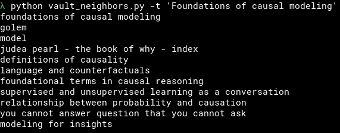

# Obsidian Vault Neighbors
## Semantic links recommendation script
<br>

## The goal 
The objective of this script is to mine meaningful semantic connections between the notes in a given Obsidian vault. As a result the user receives a list of note titles that are recommended as new connection to a given note. The user can decide to form new edges basing on the recommendation. 

## Context
Obsidian.md is an open source knowledge management software. As its creators describe it: _"Obsidian is a powerful and extensible knowledge base that works on top of your 
local folder of plain text files."_ The Obsidian allows for forward and back-links as a way of connection between notes. This approach results with a graph. It can be traversed by users in search of new meaningful connections. The quality of semantic edges in the graph is dictated by the judgement of the user.
<br>

If you want to learn more about the Obsidian, check: [Obsidian.md](obsidian.md)
<br>
* _An example of cluttered Obsidian graph (~500 notes)_


## Method
The script employs method known as [Bag of Words](https://scikit-learn.org/stable/modules/feature_extraction.html?highlight=bag+words) where each note is turned into a vector representation. Then, thanks to [Nearest Neighbors algorithm](https://scikit-learn.org/stable/modules/neighbors.html), the script calculates the distance between the notes. This allows to return a list of notes that are the closest ones to a given master-note.

## Usage
To use the script you need to have Python 3 installed on your machine as well as libraries specified in _requirements.txt_. 
All the commands here assume that you run them from the directory where vault_neighbors.py is saved.

### Installation of dependencies
_This assumes you have Python 3 already installed on your machine. If not then the easiest way to do it is to use [Anaconda distribution](https://www.anaconda.com/)._

Instalation of required libraries from _requirements.txt_:
```pip install -r requirements.txt```

### Setup:
* The script logic lives in ```vault_neighbors.py```. Download it.
* Three .txt files saved in the same location as .py file allow for more detailed parametrization. Each parameter value in these files should start a new line.
  * In order for the script to work correctly you need to specify absolute path to your vault. You can do it under ```nnpath.txt```. The alternative is to provide it in the command line once prompted.
  * ```nnignore.txt``` allows you to define directories within your vault that should be excluded from the analysis.
  * ```nnpatterns.txt``` contains regular expression patterns that script should employ to get rid of the non-meaningful phrases from your notes. As each vault is different, you probably should come up with your own list of patterns. You can also leave this file empty.

### Launching the script
This will return you 10 nearest neighbors to a note which title was passed after -t argument:
```python vault_neighbors.py -t 'note of a title'``` 

Sample output:
<br>


### Python script arguments:
You can control main parameters of the script like distance metric or number of recommendations with python script arguments. 
Below is a screnshoot of the ```python notes_neighbors.py --help```:

```
  -h, --help            show this help message and exit
  -e ENCODING, --encoding ENCODING
                        Set encoding for vault notes. Default utf-8
  -de, --drop_empty     Drop empty notes instead of filling them in with titles
  -do, --drop_outlinks  Dont take outlinks into the nearest neighbors analysis
  -ip IGNORE_PATH, --ignore_path IGNORE_PATH
                        Set path to nnignore.txt file. Default ./nnignore.txt
  -mt METRIC, --metric METRIC
                        Set distance metric for NN algorithm. Default 'cosine'. Available
                        metrics: jaccard, cosine.
  -nn NEIGHBORS_NUMBER, --neighbors_number NEIGHBORS_NUMBER
                        Set nearest neighbors number the script should return. Default 10.
  -pp PATTERN_PATH, --pattern_path PATTERN_PATH
                        Set path to nnpatterns.txt. Default ./nnpatterns.txt
  -pk, --peek           Show note content after it got processed by the script.
  -t TITLE, --title TITLE
                        Pass full note title for which you want to get nearest neighbors
  -v, --verbose         Make script output more verbose
  -vp VAULT_PATH, --vault_path VAULT_PATH
                        Set path to nnpath.txt. Default ./nnpath.txt
``` 

## Caveats
* The script has been tested Linux. 
* It's performance was tested on a vault with ~500 notes: ```1.73 s ± 79.8 ms per loop (mean ± std. dev. of 7 runs, 1 loop each)```

## TODO

- [x] User can look-up the note contents to see how it got processed by the script
- [ ] Accuracy metrics
