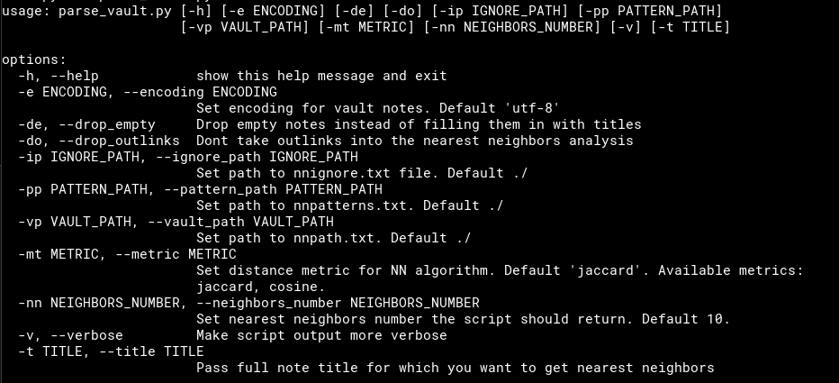

# Obsidian Vault Neighbors
## Semantic links recommendation script
<br>

## The goal 
The objective of this script is to mine meaningful semantic connections between the notes in a given Obsidian vault using NLP techniques. As a result user receives a list of note titles that are recommended as new connection to a given note.

## Context
Obsidian.md is an open source knowledge management software. As its creators describe
it: _"Obsidian is a powerful and extensible knowledge base that works on top of your 
local folder of plain text files."_
The Obsidian allows for forward and back-links as a way of connection between notes.
This method produces a graph. It can be traversed by users in search of further 
meaningful connections. The quality of semantic edges in the graph is dictated by 
the judgement of the user.
<br>

If you want to learn more about the Obsidian, check: [Obsidian.md](obsidian.md)
<br>
* An example of cluttered Obsidian graph (~500 notes)


## Method
The script employs [Nearest Neighbors algorithm](https://scikit-learn.org/stable/modules/neighbors.html) that allows for calculation of the distance between the notes. Thanks to having an objective distance metrics, the script can return a list of notes that are closest to a given note in terms of the frequency of the language used.

## Usage
To use the script you need to have Python 3.10 and libraries specified in requirements.txt installed on your machine. If this is the case, then you can launch the script easily from CLI with ```python notes_neighbors.py```

### Setup:
* In order for the script to work correctly you need to define absolute path to your vault. You can do it under ```nnpath.txt``` saved in the same location as the script. The alternative is to provide it in the command line once prompted.
* ```nnignore.txt``` allows you to define directories within your vault that should be excluded from the analysis.
* ```nnpatterns.txt``` contains regular expression patterns that script should employ to get rid of the not meaningful phrases from your notes. As each vault is different, you probably should come up with your own list of patterns. You can also leave this file empty. 

### Python script arguments:
You can control main parameters of the script like distance metric or number of recommendations with python script arguments. 
Below is a screnshoot of the ```python notes_neighbors.py --help```:

